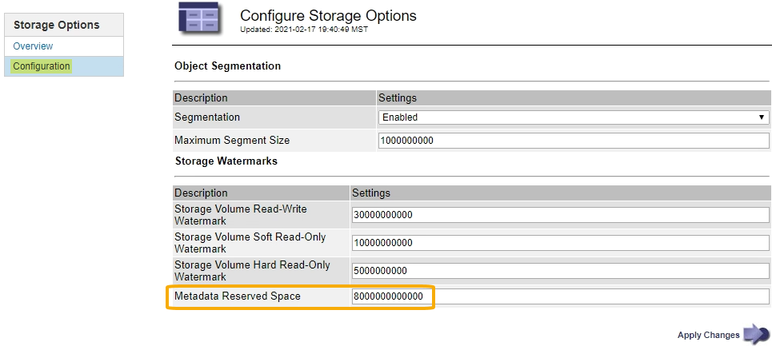

= Aumentando a configuração espaço reservado metadados
:allow-uri-read: 
:icons: font
:imagesdir: ../media/

[role="lead"]
Depois de atualizar para o StorageGRID 11,5, você poderá aumentar a configuração do sistema espaço reservado de metadados se seus nós de armazenamento atenderem a requisitos específicos de RAM e espaço disponível.

.O que você vai precisar
* Você deve estar conetado ao Gerenciador de Grade usando um navegador compatível.
* Você deve ter a permissão de acesso root ou a Configuração da Página de topologia de Grade e outras permissões de Configuração de Grade.
* Iniciou a atualização do StorageGRID 11,5 e a tarefa de atualização *Ativar novos recursos* foi concluída.

.Sobre esta tarefa
Você pode aumentar manualmente a configuração de espaço reservado de metadados em todo o sistema até 8 TB após a atualização para o StorageGRID 11,5. A reserva de espaço adicional de metadados após a atualização do 11,5 simplificará futuras atualizações de hardware e software.

Você só pode aumentar o valor da configuração espaço reservado de metadados em todo o sistema se ambas as instruções forem verdadeiras:

* Os nós de storage em qualquer local do seu sistema têm 128 GB ou mais de RAM.
* Cada um dos nós de storage em qualquer local do sistema tem espaço disponível suficiente no volume de storage 0.

Esteja ciente de que, se você aumentar essa configuração, reduzirá simultaneamente o espaço disponível para storage de objetos no volume de storage 0 de todos os nós de storage. Por esse motivo, você pode preferir definir o espaço reservado de metadados para um valor menor que 8 TB, com base nos requisitos esperados de metadados de objeto.

NOTE: Em geral, é melhor usar um valor mais alto em vez de um valor mais baixo. Se a configuração espaço reservado de metadados for muito grande, você poderá diminuí-la mais tarde. Em contraste, se você aumentar o valor mais tarde, o sistema pode precisar mover dados de objeto para liberar espaço.

Para uma explicação detalhada de como a configuração espaço reservado metadados afeta o espaço permitido para armazenamento de metadados de objetos em um nó de armazenamento específico, vá para as instruções de administração do StorageGRID e procure "armazenamento de metadados de objetos".

link:../admin/index.html["Administrar o StorageGRID"]

.Passos
. Faça login no Gerenciador de Grade usando um navegador compatível.
. Determine a configuração atual espaço reservado de metadados.
+
.. Selecione *Configuração* > *Configurações do sistema* > *Opções de armazenamento*.
.. Na seção marcas de água de armazenamento, observe o valor de *espaço reservado de metadados*.

. Certifique-se de que tem espaço disponível suficiente no volume de armazenamento 0 de cada nó de armazenamento para aumentar este valor.
+
.. Selecione *nós*.
.. Selecione o primeiro nó de armazenamento na grade.
.. Selecione a guia armazenamento .
.. Na seção volumes, localize a entrada */var/local/rangedb/0*.
.. Confirme se o valor disponível é igual ou superior à diferença entre o novo valor que pretende utilizar e o valor de espaço reservado de metadados atual.
+
Por exemplo, se a configuração espaço reservado de metadados for atualmente de 4 TB e você quiser aumentá-la para 6 TB, o valor disponível deverá ser de 2 TB ou superior.

.. Repita estas etapas para todos os nós de storage.
+
*** Se um ou mais nós de armazenamento não tiverem espaço disponível suficiente, o valor espaço reservado de metadados não poderá ser aumentado. Não prossiga com este procedimento.
*** Se cada nó de armazenamento tiver espaço disponível suficiente no volume 0, vá para a próxima etapa.

. Certifique-se de que tem pelo menos 128 GB de RAM em cada nó de armazenamento.
+
.. Selecione *nós*.
.. Selecione o primeiro nó de armazenamento na grade.
.. Selecione a guia *hardware*.
.. Passe o cursor sobre o gráfico de uso da memória. Certifique-se de que *Total Memory* é de pelo menos 128 GB.
.. Repita estas etapas para todos os nós de storage.
+
*** Se um ou mais nós de armazenamento não tiverem memória total disponível suficiente, o valor de espaço reservado de metadados não poderá ser aumentado. Não prossiga com este procedimento.
*** Se cada nó de armazenamento tiver pelo menos 128 GB de memória total, vá para a próxima etapa.

. Atualize a configuração espaço reservado metadados.
+
.. Selecione *Configuração* > *Configurações do sistema* > *Opções de armazenamento*.
.. Selecione o separador Configuration (Configuração).
.. Na seção marcas d'água de armazenamento, selecione *espaço reservado de metadados*.
.. Introduza o novo valor.
+
Por exemplo, para introduzir 8 TB, que é o valor máximo suportado, introduza *8000000000000* (8, seguido de 12 zeros)

+

.. Selecione *aplicar alterações*.

