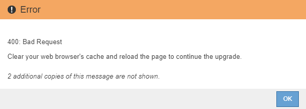

= Iniciar a atualização
:allow-uri-read: 
:icons: font
:imagesdir: ../media/

[role="lead"]
Quando estiver pronto para executar a atualização, selecione o ficheiro transferido e introduza a frase-passe de aprovisionamento. Como opção, você pode executar as pré-verificações de atualização antes de executar a atualização real.

.O que você vai precisar
Você revisou todas as considerações e concluiu todas as etapas em link:upgrade-planning-and-preparation.html["Planejamento e preparação de atualização"].

.Passos
. Faça login no Gerenciador de Grade usando um navegador compatível.
. Selecione *Manutenção* > *sistema* > *Atualização de Software*.
+
A página Atualização de software é exibida.

. Selecione *Atualização StorageGRID*.
+
A página Atualização do StorageGRID é exibida e mostra a data e a hora da atualização mais recente concluída, a menos que o nó de administração principal tenha sido reiniciado ou a API de gerenciamento seja reiniciada desde que a atualização foi realizada.

. Selecione o `.upgrade` ficheiro que transferiu.
+
.. Selecione *Procurar*.
.. Localize e selecione o arquivo: `NetApp_StorageGRID_version_Software_uniqueID.upgrade`
.. Selecione *Open*.
+
O arquivo é carregado e validado. Quando o processo de validação for concluído, uma marca de seleção verde aparece ao lado do nome do arquivo de atualização.

. Insira a senha de provisionamento na caixa de texto.
+
Os botões *Run Prechecks* e *Start Upgrade* ficam ativados.

+
image::../media/storagegrid_upgrade_buttons_enabled.png[Botões de atualização do StorageGRID ativados]

. Se pretender validar a condição do seu sistema antes de iniciar a atualização real, selecione *Executar pré-verificações*. Em seguida, resolva quaisquer erros de pré-verificação que sejam relatados.
+

IMPORTANT: Se tiver aberto quaisquer portas de firewall personalizadas, será notificado durante a validação de pré-verificação. Você deve entrar em Contato com o suporte técnico antes de prosseguir com a atualização.

+

NOTE: As mesmas pré-verificações são realizadas quando você seleciona *Iniciar atualização*. Selecionar *Executar pré-verificações* permite detetar e resolver problemas antes de iniciar a atualização.

. Quando estiver pronto para executar a atualização, selecione *Iniciar atualização*.
+
Um aviso aparece para lembrá-lo de que a conexão do seu navegador será perdida quando o nó Admin principal for reiniciado. Quando o nó de administração principal estiver disponível novamente, você precisa limpar o cache do navegador da Web e recarregar a página Atualização de software.

+
image::../media/software_upgrade_connection_will_be_lost.png[A ligação de atualização de software será perdida]

. Selecione *OK* para confirmar o aviso e iniciar o processo de atualização.
+
Quando a atualização é iniciada:

+
.. As pré-verificações de atualização são executadas.
+

NOTE: Se algum erro de pré-verificação for relatado, resolva-os e selecione *Iniciar atualização* novamente.

.. O nó de administração principal é atualizado, o que inclui parar serviços, atualizar o software e reiniciar serviços. Você não poderá acessar o Gerenciador de Grade enquanto o nó Admin principal estiver sendo atualizado. Os logs de auditoria também estarão indisponíveis. Esta atualização pode demorar até 30 minutos.
+

NOTE: Enquanto o nó Admin principal está sendo atualizado, várias cópias das seguintes mensagens de erro aparecem, que você pode ignorar.

+
image::../media/software_upgrade_problem_connecting_error.png[Problema na atualização de software erro de ligação]

+
image::../media/software_upgrade_503_error.png[Erro de atualização de software 503]

+

. Depois que o nó Admin principal tiver sido atualizado, limpe o cache do navegador da Web, inicie sessão novamente e recarregue a página Atualização de Software.
+
Para obter instruções, consulte a documentação do navegador da Web.

+

IMPORTANT: Você deve limpar o cache do navegador da Web para remover recursos desatualizados usados pela versão anterior do software.

.Informações relacionadas
link:upgrade-planning-and-preparation.html["Planejamento e preparação de atualização"]
